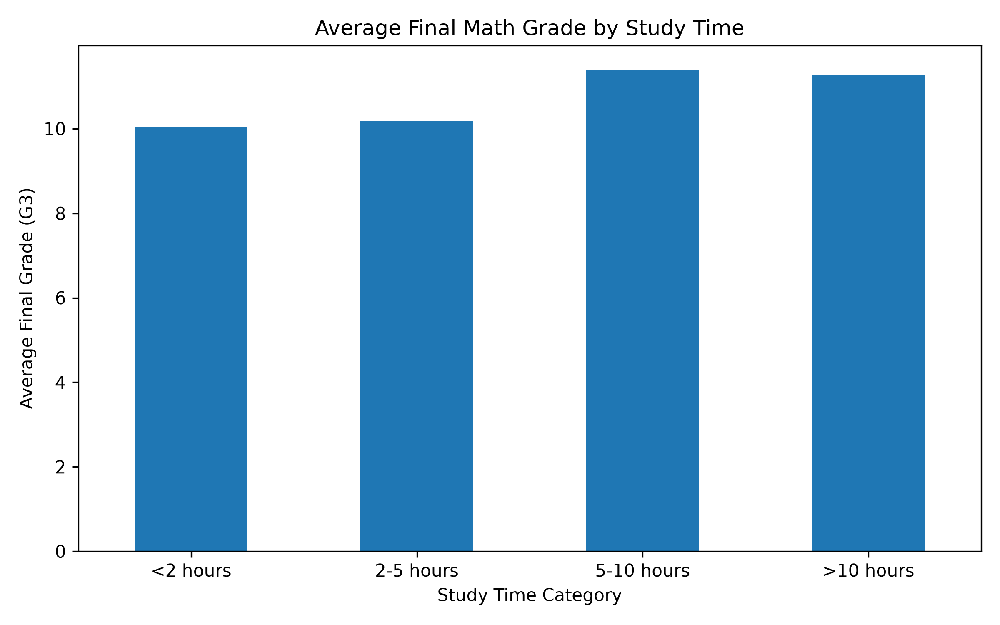
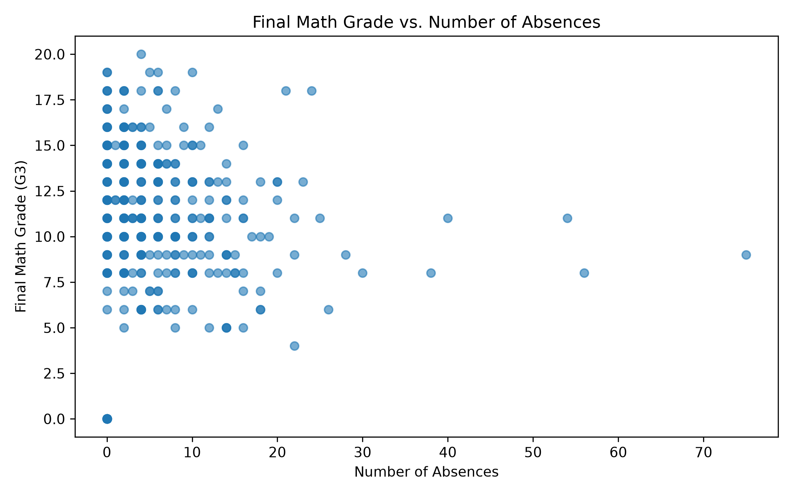
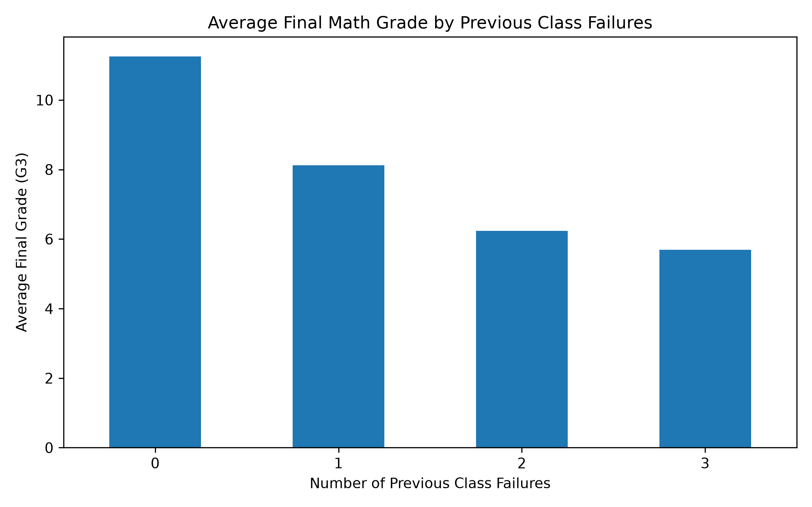

# Projects

## Student Performance Analysis

### Research Question

How do study time, absences, and previous class failures relate to students' final math grades?

### Project Overview

This project analyzes student performance data from the UCI Machine Learning Repository. The goal is to explore whether study habits, school absences, and previous class failures are related to students' final mathematics grades.

### Why This Question Matters

Understanding which student factors are associated with academic performance can help educators identify patterns that may deserve further attention. Students, teachers, and schools could use this type of analysis to better understand academic challenges and consider where additional support may be useful.

However, these results should not be used to label or predict an individual student's ability because the analysis is based on a limited observational dataset.

### Dataset

The dataset used in this project is the Student Performance dataset from the UCI Machine Learning Repository.

I accessed the dataset through the UCI API and also used web scraping on the official UCI webpage to locate the publicly available download link. The mathematics dataset was then downloaded and extracted programmatically.

For this project, the mathematics dataset contains 395 student records and 33 columns. Each row represents one student in a mathematics course at one of two Portuguese secondary schools.

The dataset includes demographic information, family and school information, study habits, absences, previous class failures, and student grades. The main variables used in this analysis are:

- **Study Time:** Weekly study time reported in four categories
- **Absences:** Number of school absences
- **Previous Failures:** Number of previous class failures
- **Final Grade (G3):** Final mathematics grade on a 0–20 scale

The dataset contained no missing values, so no observations needed to be removed or imputed.

### Data Acquisition Ethics

The dataset was obtained from the official UCI Machine Learning Repository. I used a single request to the official UCI webpage to locate the publicly available download link and did not use login credentials or make excessive requests. The dataset was downloaded programmatically from the official source.

### Conceptualization and Operationalization

**Study Time**

Study time refers to the amount of time a student spends studying outside of regular class time. It is measured using four categories: less than 2 hours, 2–5 hours, 5–10 hours, and more than 10 hours per week.

**Absences**

Absences represent how often a student misses school. They are measured as the number of school absences recorded for each student.

**Previous Class Failures**

Previous class failures represent a student's history of failing classes before the current course. The variable records the number of previous class failures from 0 to 3.

**Final Math Grade**

Final math grade represents a student's academic performance in the mathematics course. It is measured using the G3 variable on a scale from 0 to 20.

### Data Cleaning

I checked the dataset for missing values using pandas. All columns had 0 missing values, so no rows needed to be removed and no missing values needed to be filled.

I kept the original values for study time, absences, previous class failures, and final grade because these variables are important to the research question. I also kept the study time categories as provided by the original dataset rather than changing them into exact hours.

### Methods

I used Python, pandas, matplotlib, and scikit-learn to analyze the data.

The analysis included:

- Exploratory data analysis
- Data cleaning and preparation
- Bar charts and scatter plots
- Correlation analysis
- Linear regression
- Logistic regression
- Decision tree classification

### Key Findings

Previous class failures showed the clearest relationship with final math grades. Students with more previous class failures generally had lower average final grades.

Study time had a smaller relationship with final grades. Students who reported more study time generally had slightly higher average grades, but the differences between study-time groups were relatively small.

Absences showed very little linear relationship with final grades. The correlation between absences and final grade was approximately 0.03.

The correlation between previous failures and final grade was approximately -0.36, while the correlation between study time and final grade was approximately 0.10.

### Visualizations

#### Study Time and Final Grade

Students who reported more study time generally had slightly higher final grades, although the differences between groups were relatively small.

#### Absences and Final Grade

The relationship between absences and final grades was very weak in this dataset. The points are widely spread, and the correlation was approximately 0.03.

#### Previous Failures and Final Grade

Previous class failures showed the clearest pattern. Students with more previous failures generally had lower average final grades.

### Model Results

#### Linear Regression

The linear regression model used study time, absences, and previous class failures to predict final math grades.

- **R²:** approximately 0.03
- **RMSE:** approximately 4.46 points

The low R² means that these three variables explained only about 3% of the variation in final grades.

Previous class failures had the strongest coefficient at approximately -2.27. This means that each additional previous failure was associated with about a 2.27-point decrease in predicted final grade when the other variables were held constant.

#### Logistic Regression

The logistic regression model predicted whether a student passed or failed using study time, absences, and previous class failures.

- **Accuracy:** approximately 73.4%

The model was better at identifying students who passed than students who failed.

#### Decision Tree

The decision tree also predicted whether students passed or failed.

- **Accuracy:** approximately 75.9%

The decision tree performed slightly better than logistic regression. Previous class failures appeared near the top of the tree, suggesting that this variable was especially useful for classification.

### Overall Results

Overall, previous class failures showed the strongest relationship with final math performance. Study time had a smaller relationship with grades, while absences showed very little linear relationship with final grade.

The classification models were able to predict passing and failing students with moderate accuracy, with the decision tree performing slightly better than logistic regression. However, the low R² from the linear regression shows that study time, absences, and previous failures alone do not explain most of the differences in students' final grades.

### Limitations and Potential Bias

There are several limitations to this analysis. First, the dataset only includes students from two Portuguese secondary schools, so the results may not apply to students from other schools, countries, or age groups.

Another limitation is that the analysis only uses study time, absences, and previous class failures to predict final grades. Other factors, such as motivation, family support, teaching quality, socioeconomic background, and access to academic resources could also affect student performance.

The study-time variable is reported in categories rather than exact numbers of hours, which limits how precisely study habits can be measured.

In addition, the dataset is observational, so the results show relationships between variables but cannot prove that study time, absences, or previous failures directly cause changes in grades.

Finally, the classification models had moderate accuracy rather than perfect accuracy. This suggests that these three variables alone are not enough to accurately predict every student's performance.

### What I Would Explore Next

With more time and data, I would examine additional factors such as motivation, family support, socioeconomic background, and school characteristics.

I would also compare the mathematics and Portuguese datasets to see whether the relationships found here are similar across subjects. Future analysis could use additional data from other schools or countries to test whether the patterns generalize.

### Code

[View the Full Jupyter Notebook](student_performance_analysis.ipynb)

### Dataset Source

Cortez, P. (2008). *Student Performance* [Dataset]. UCI Machine Learning Repository. https://doi.org/10.24432/C5TG7T

### AI Usage Disclosure

I used OpenAI ChatGPT (GPT-5.6) to help brainstorm the research question, explain Python code and model outputs, troubleshoot coding errors, and improve the organization and wording of this project. I reviewed the suggestions and ran the analysis myself in Python.

### References

Aucejo, E. M., & Romano, T. F. (2016). Assessing the effect of school days and absences on test score performance. *Economics of Education Review, 55*, 70–87. https://doi.org/10.1016/j.econedurev.2016.08.007

Nonis, S. A., & Hudson, G. I. (2010). Performance of college students: Impact of study time and study habits. *Journal of Education for Business, 85*(4), 229–238. https://doi.org/10.1080/08832320903449550

Plant, E. A., Ericsson, K. A., Hill, L., & Asberg, K. (2005). Why study time does not predict grade point average across college students: Implications of deliberate practice for academic performance. *Contemporary Educational Psychology, 30*(1), 96–116. https://doi.org/10.1016/j.cedpsych.2004.06.001
