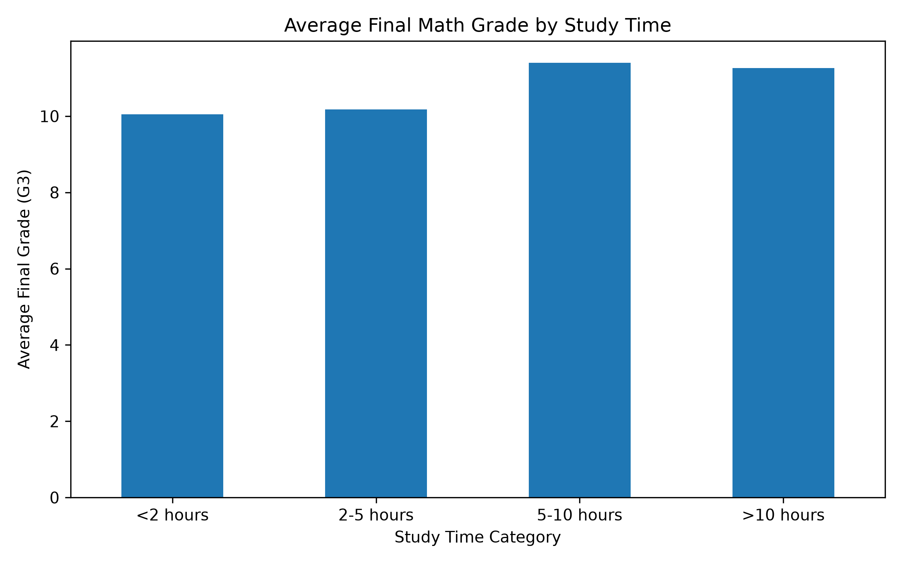
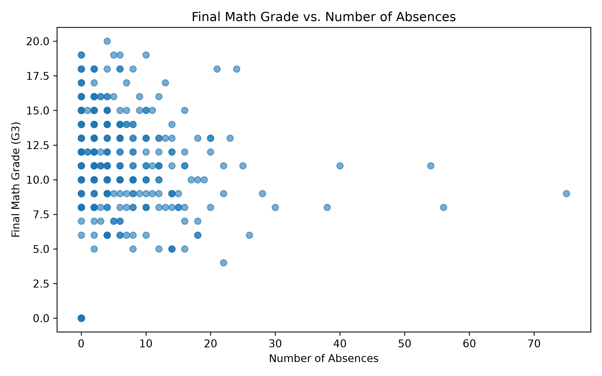
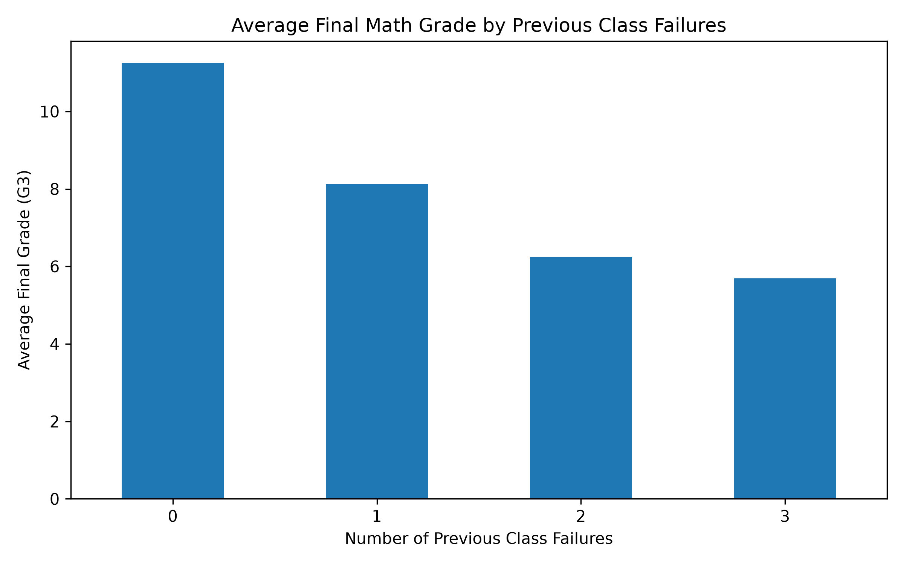
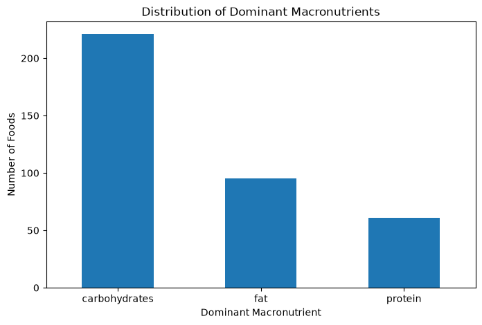
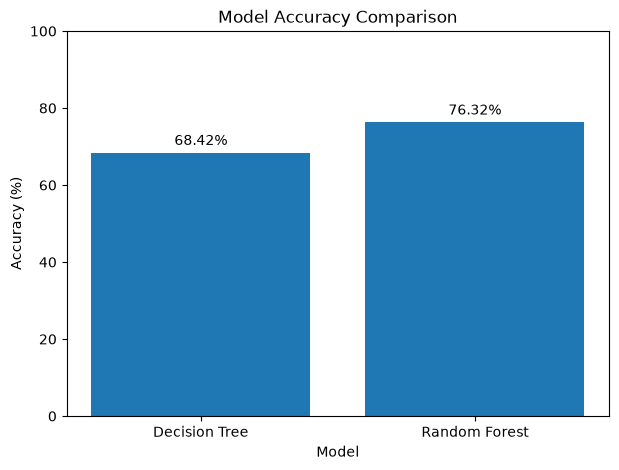

# Projects

## Student Performance Analysis

### Research Question

How do study time, absences, and previous class failures relate to students' final math grades?

### Project Overview

This project analyzes student performance data from the UCI Machine Learning Repository. The goal is to explore whether study habits, school absences, and previous class failures are related to students' final mathematics grades.

### Why This Question Matters

Understanding which student factors are associated with academic performance can help educators identify patterns that may deserve further attention. Students, teachers, and schools could use this type of analysis to better understand academic challenges and consider where additional support may be useful.

However, these results should not be used to label or predict an individual student's ability because the analysis is based on a limited observational dataset.

### Dataset

The dataset used in this project is the Student Performance dataset from the UCI Machine Learning Repository.

I accessed the dataset through the UCI API and also used web scraping on the official UCI webpage to locate the publicly available download link. The mathematics dataset was then downloaded and extracted programmatically.

For this project, the mathematics dataset contains 395 student records and 33 columns. Each row represents one student in a mathematics course at one of two Portuguese secondary schools.

The dataset includes demographic information, family and school information, study habits, absences, previous class failures, and student grades. The main variables used in this analysis are:

- **Study Time:** Weekly study time reported in four categories
- **Absences:** Number of school absences
- **Previous Failures:** Number of previous class failures
- **Final Grade (G3):** Final mathematics grade on a 0–20 scale

The dataset contained no missing values, so no observations needed to be removed or imputed.

### Data Acquisition Ethics

The dataset was obtained from the official UCI Machine Learning Repository. I used a single request to the official UCI webpage to locate the publicly available download link and did not use login credentials or make excessive requests. The dataset was downloaded programmatically from the official source.

### Conceptualization and Operationalization

**Study Time**

Study time refers to the amount of time a student spends studying outside of regular class time. It is measured using four categories: less than 2 hours, 2–5 hours, 5–10 hours, and more than 10 hours per week.

**Absences**

Absences represent how often a student misses school. They are measured as the number of school absences recorded for each student.

**Previous Class Failures**

Previous class failures represent a student's history of failing classes before the current course. The variable records the number of previous class failures from 0 to 3.

**Final Math Grade**

Final math grade represents a student's academic performance in the mathematics course. It is measured using the G3 variable on a scale from 0 to 20.

### Data Cleaning

I checked the dataset for missing values using pandas. All columns had 0 missing values, so no rows needed to be removed and no missing values needed to be filled.

I kept the original values for study time, absences, previous class failures, and final grade because these variables are important to the research question. I also kept the study time categories as provided by the original dataset rather than changing them into exact hours.

### Methods

I used Python, pandas, matplotlib, and scikit-learn to analyze the data.

The analysis included:

- Exploratory data analysis
- Data cleaning and preparation
- Bar charts and scatter plots
- Correlation analysis
- Linear regression
- Logistic regression
- Decision tree classification

### Key Findings

Previous class failures showed the clearest relationship with final math grades. Students with more previous class failures generally had lower average final grades.

Study time had a smaller relationship with final grades. Students who reported more study time generally had slightly higher average grades, but the differences between study-time groups were relatively small.

Absences showed very little linear relationship with final grades. The correlation between absences and final grade was approximately 0.03.

The correlation between previous failures and final grade was approximately -0.36, while the correlation between study time and final grade was approximately 0.10.

### Visualizations

#### Study Time and Final Grade

Students who reported more study time generally had slightly higher final grades, although the differences between groups were relatively small.

#### Absences and Final Grade

The relationship between absences and final grades was very weak in this dataset. The points are widely spread, and the correlation was approximately 0.03.

#### Previous Failures and Final Grade

Previous class failures showed the clearest pattern. Students with more previous failures generally had lower average final grades.

### Model Results

#### Linear Regression

The linear regression model used study time, absences, and previous class failures to predict final math grades.

- **R²:** approximately 0.03
- **RMSE:** approximately 4.46 points

The low R² means that these three variables explained only about 3% of the variation in final grades.

Previous class failures had the strongest coefficient at approximately -2.27. This means that each additional previous failure was associated with about a 2.27-point decrease in predicted final grade when the other variables were held constant.

#### Logistic Regression

The logistic regression model predicted whether a student passed or failed using study time, absences, and previous class failures.

- **Accuracy:** approximately 73.4%

The model was better at identifying students who passed than students who failed.

#### Decision Tree

The decision tree also predicted whether students passed or failed.

- **Accuracy:** approximately 75.9%

The decision tree performed slightly better than logistic regression. Previous class failures appeared near the top of the tree, suggesting that this variable was especially useful for classification.

### Overall Results

Overall, previous class failures showed the strongest relationship with final math performance. Study time had a smaller relationship with grades, while absences showed very little linear relationship with final grade.

The classification models were able to predict passing and failing students with moderate accuracy, with the decision tree performing slightly better than logistic regression. However, the low R² from the linear regression shows that study time, absences, and previous failures alone do not explain most of the differences in students' final grades.

### Limitations and Potential Bias

There are several limitations to this analysis. First, the dataset only includes students from two Portuguese secondary schools, so the results may not apply to students from other schools, countries, or age groups.

Another limitation is that the analysis only uses study time, absences, and previous class failures to predict final grades. Other factors, such as motivation, family support, teaching quality, socioeconomic background, and access to academic resources could also affect student performance.

The study-time variable is reported in categories rather than exact numbers of hours, which limits how precisely study habits can be measured.

In addition, the dataset is observational, so the results show relationships between variables but cannot prove that study time, absences, or previous failures directly cause changes in grades.

Finally, the classification models had moderate accuracy rather than perfect accuracy. This suggests that these three variables alone are not enough to accurately predict every student's performance.

### What I Would Explore Next

With more time and data, I would examine additional factors such as motivation, family support, socioeconomic background, and school characteristics.

I would also compare the mathematics and Portuguese datasets to see whether the relationships found here are similar across subjects. Future analysis could use additional data from other schools or countries to test whether the patterns generalize.

### Code

[View the Full Jupyter Notebook](https://github.com/yverma3-ai/data-science-portfolio/blob/main/student_performance_analysis.ipynb)

### Dataset Source

Cortez, P. (2008). *Student Performance* [Dataset]. UCI Machine Learning Repository. https://doi.org/10.24432/C5TG7T

### AI Usage Disclosure

I used OpenAI ChatGPT (GPT-5.6) to help brainstorm the research question, explain Python code and model outputs, troubleshoot coding errors, and improve the organization and wording of this project. I reviewed the suggestions and ran the analysis myself in Python.

### References

Aucejo, E. M., & Romano, T. F. (2016). Assessing the effect of school days and absences on test score performance. *Economics of Education Review, 55*, 70–87. https://doi.org/10.1016/j.econedurev.2016.08.007

Nonis, S. A., & Hudson, G. I. (2010). Performance of college students: Impact of study time and study habits. *Journal of Education for Business, 85*(4), 229–238. https://doi.org/10.1080/08832320903449550

Plant, E. A., Ericsson, K. A., Hill, L., & Asberg, K. (2005). Why study time does not predict grade point average across college students: Implications of deliberate practice for academic performance. *Contemporary Educational Psychology, 30*(1), 96–116. https://doi.org/10.1016/j.cedpsych.2004.06.001

---

## Predicting Dominant Macronutrients in Foods

### Problem Definition

The goal of this project is to determine whether nutritional information can be used to predict whether a food is primarily dominated by carbohydrates, fat, or protein. The target variable is the dominant macronutrient, making this a classification problem.

Understanding the dominant macronutrient of a food can make nutritional information easier to interpret. This type of model could be useful for people interested in understanding food composition or exploring patterns in nutritional data.

### Background and Context

Macronutrients are nutrients that provide energy and include carbohydrates, protein, and fat. Understanding the macronutrient composition of foods is useful for studying nutrition and comparing the nutritional characteristics of different foods.

The Food and Agriculture Organization explains that carbohydrates and protein provide approximately 4 calories per gram, while fat provides approximately 9 calories per gram. These energy conversion values are commonly known as the Atwater general factors. In this project, these values were used to determine which macronutrient contributes the most energy to each food.

The data for this project come from the U.S. Department of Agriculture's FoodData Central database. FoodData Central contains several types of food composition data. I focused on Foundation Foods because they provide detailed nutrient profiles and information about basic foods and ingredients.

Research and nutritional guidance also recognize carbohydrates, fats, and proteins as important components of human nutrition. The National Academies' Dietary Reference Intake research evaluates these macronutrients along with dietary fiber and energy intake. Together, these sources provide the nutritional basis for examining whether other food characteristics can help predict a food's dominant macronutrient.

### Data Description

The data used in this project come from the U.S. Department of Agriculture's FoodData Central database. The original files contain food descriptions, nutrient measurements, and information identifying different nutrients.

The food dataset contained 87,990 food records. Because the database contains several different types of food records, I limited the analysis to Foundation Foods. This resulted in 469 Foundation Food records. Each row in the final analysis represents one food.

The target variable is `dominant_macronutrient`, which identifies whether protein, carbohydrates, or fat contributes the most calories to a food. The target was created by converting each macronutrient to calories using 4 calories per gram for protein, 4 calories per gram for carbohydrates, and 9 calories per gram for fat.

The dataset contained nutritional variables including protein, carbohydrates, fat, fiber, sodium, sugar, and calories. For the machine-learning models, I selected fiber, sodium, and calories as predictor features. Protein, carbohydrates, and fat were excluded from the predictors because those variables were already used to create the target and including them would cause data leakage.

Some nutrient values were missing, and not every Foundation Food had complete protein, carbohydrate, and fat information. After requiring complete values for those three macronutrients, 377 foods remained for modeling.

### Data Understanding and Exploration

Before building the models, I explored the data to better understand the nutritional variables and the distribution of the target. Of the 469 Foundation Foods, 377 had complete values for protein, carbohydrates, and fat and could be used to create the target variable.

The target classes were not evenly distributed. Of the 377 foods, 221 were carbohydrate-dominant, 95 were fat-dominant, and 61 were protein-dominant. This shows a clear class imbalance, with carbohydrate-dominant foods making up the largest group. Because of this imbalance, I used evaluation measures beyond accuracy, including precision, recall, F1-score, and confusion matrices.

I also examined missing values in the potential predictor features. Fiber, sodium, and calories contained missing values, so removing every food with a missing predictor would have reduced the modeling dataset from 377 foods to only 54. To preserve more of the available data, missing predictor values were handled using median imputation.

The exploratory analysis helped guide feature selection. Fiber, sodium, and calories were selected as predictors because they provide nutritional information without directly using the protein, carbohydrate, and fat values that determine the target.

### Data Preparation and Feature Selection

Before modeling, I filtered the dataset to include only Foundation Foods. Foods that were missing protein, carbohydrate, or fat values were removed because these values were necessary to determine the target variable. This left 377 foods for the analysis.

For the predictor variables, missing values in fiber, sodium, and calories were filled using the median of each feature. Median imputation was chosen because it is less affected by unusually high or low values than the mean and allowed all 377 foods to remain in the modeling dataset.

The predictor features selected for the models were fiber, sodium, and calories. Protein, carbohydrates, and fat were intentionally excluded because these variables were used to calculate the dominant macronutrient target. Including them as predictors would create data leakage by giving the models information that directly determines the correct answer.

The data were divided into training and testing sets using an 80/20 split. A random state of 42 was used for reproducibility, and stratification was used so that the distribution of carbohydrate-, fat-, and protein-dominant foods remained similar between the training and testing sets.

### Baseline and Model Development

Before training the machine-learning models, I created a baseline model for comparison. The baseline always predicted carbohydrates, which was the most common target class in the dataset. This baseline achieved an accuracy of 59.21%.

I then trained two classification models: a Decision Tree and a Random Forest. Both models are appropriate for this project because the target consists of three categories: carbohydrates, fat, and protein.

For the Decision Tree, I set the maximum tree depth to 4 to limit the complexity of the model. The Random Forest used 100 decision trees. A random state of 42 was used to make the results reproducible.

Both models were trained using the same training data and evaluated using the same testing data. This allowed their performance to be compared under the same conditions.

### Model Evaluation and Selection

The models were evaluated using accuracy, precision, recall, F1-score, and confusion matrices. Accuracy measures the overall percentage of correct predictions, while precision, recall, and F1-score provide more information about performance for each individual class. These additional metrics were important because the target classes were imbalanced.

The baseline model achieved an accuracy of 59.21%. The Decision Tree improved on the baseline with an accuracy of 68.42%, while the Random Forest achieved the highest accuracy at 76.32%.

The Random Forest performed especially well when identifying carbohydrate-dominant foods. For this class, it achieved a precision of 0.84, recall of 0.91, and F1-score of 0.87. Its performance was lower for fat-dominant foods and lowest for protein-dominant foods.

Overall, I selected the Random Forest as the final model because it achieved the highest overall accuracy and performed better than both the baseline and Decision Tree. Its accuracy was 7.90 percentage points higher than the Decision Tree and 17.11 percentage points higher than the baseline.

### Model Interpretation and Insights

Feature importance from the Random Forest showed that sodium was the most influential predictor, with an importance of approximately 0.57. Fiber was the second most important feature at approximately 0.23, followed by calories at approximately 0.20.

The model performed best on carbohydrate-dominant foods. The confusion matrix and classification report showed that 41 of the 45 carbohydrate-dominant foods in the test set were classified correctly. The model had more difficulty distinguishing between fat- and protein-dominant foods.

These results suggest that the selected nutritional characteristics contain useful information for distinguishing between dominant macronutrient categories. However, feature importance does not prove that sodium, fiber, or calories cause a food to have a particular dominant macronutrient. It only shows how useful each feature was to the Random Forest when making predictions in this dataset.

### Limitations, Ethics, and Reflection

This project has several limitations. The final modeling dataset contained only 377 Foundation Foods, so it does not represent every type of food available in FoodData Central. The target classes were also imbalanced, with substantially more carbohydrate-dominant foods than protein-dominant foods. This may have contributed to the model performing better on carbohydrate-dominant foods.

Another limitation is that some fiber, sodium, and calorie values were missing and had to be filled using median values. Although this allowed more foods to remain in the analysis, the imputed values are estimates and may not perfectly represent the actual nutrient content of those foods.

Incorrect predictions could be misleading if someone used the model to make nutritional decisions. For example, incorrectly labeling a protein-dominant food as carbohydrate-dominant could give someone an inaccurate understanding of that food's nutritional composition. Because of this, the model should be viewed as an educational data-science project rather than a tool for making medical or dietary decisions.

In the future, the project could be improved by using a larger and more balanced dataset, exploring additional features that do not create data leakage, testing additional machine-learning models, and using methods such as cross-validation and hyperparameter tuning. These improvements could provide a more reliable estimate of model performance and potentially improve predictions.

### Code and Transparency

The complete Python code and Jupyter Notebook used for this project are available through my GitHub portfolio repository. The notebook contains the data preparation, exploratory analysis, model development, evaluation, visualizations, and interpretation used throughout this project.

**Jupyter Notebook:** [View the complete analysis](https://nbviewer.org/github/yverma3-ai/data-science-portfolio/blob/main/food_macro_analysis.ipynb)

#### AI Usage Disclosure

I used OpenAI's ChatGPT (GPT-5.6) as a generative AI tool during this project. I used ChatGPT to help explain machine-learning concepts, troubleshoot and organize Python code, interpret model outputs, and improve the organization and clarity of the written project. I reviewed the code and results throughout the project and ran the completed notebook from beginning to end to verify that it executed successfully.

### References

Food and Agriculture Organization of the United Nations. (2003). *Food energy: Methods of analysis and conversion factors*. FAO Food and Nutrition Paper 77.

Institute of Medicine. (2005). *Dietary reference intakes for energy, carbohydrate, fiber, fat, fatty acids, cholesterol, protein, and amino acids*. The National Academies Press. https://doi.org/10.17226/10490

U.S. Department of Agriculture, Agricultural Research Service. (2024). *FoodData Central: Foundation Foods*. FoodData Central.
